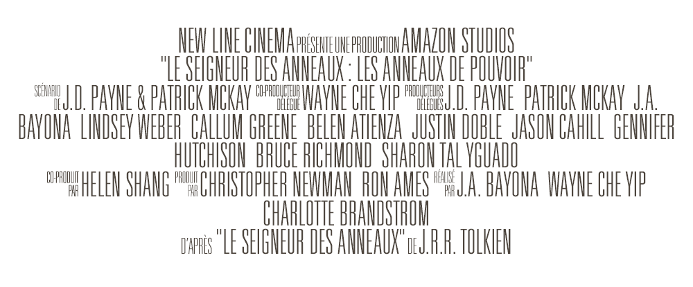

## Universal Accreditation - French Edition

  

D'après [Universal Accreditation](https://tracertong.co.uk/ttfw3/product/uni_acc/) de [TracerTong Fontworks](https://tracertong.co.uk/ttfw3/), elle même basée sur `Univers LT Std 39 Thin Ultra Condensed` d'[Adrian Frutiger](https://en.wikipedia.org/wiki/Adrian_Frutiger).

> Bien le bonjour ! 
> Je ne suis ni graphiste ni font designer, ceci est un travail amateur. 
> Je suis ouvert aux remarques et suggestions mais ne perdez pas de l'esprit que j'ai peu ou pas de connaissance sur le sujet.

#### Ajout
Ĝ (U+011C) ➟ d'après 
Ĵ (U+0134) ➟ de 
ĵ (U+0135) ➟ espace court (équivalent de l'espace à droite des autres symboles) 
Ĩ (U+0128) ➟ un 
ĩ (U+0129) ➟ une 
